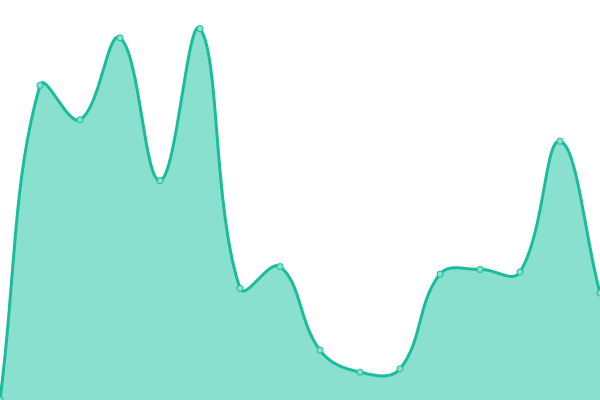
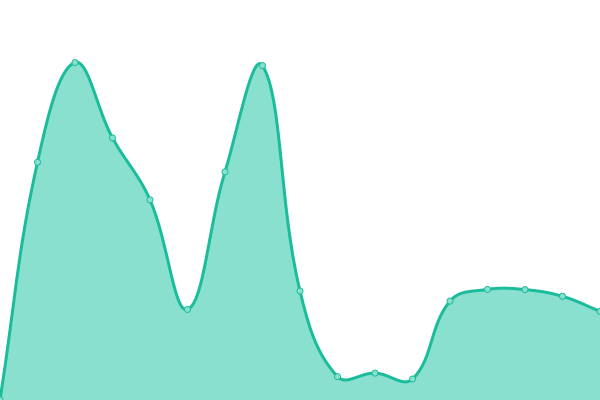

# [📈 Live Status](https://status.siege-green.com): <!--live status--> **🟧 Partial outage**

This repository contains the open-source uptime monitor and status page for [M.Cafe](https://side5.net), powered by [Upptime](https://github.com/upptime/upptime).

With [Upptime](https://upptime.js.org), you can get your own unlimited and free uptime monitor and status page, powered entirely by a GitHub repository. We use [Issues](https://github.com/meloncafe/upptime/issues) as incident reports, [Actions](https://github.com/meloncafe/upptime/actions) as uptime monitors, and [Pages](https://status.siege-green.com) for the status page.

<!--start: status pages-->
<!-- This summary is generated by Upptime (https://github.com/upptime/upptime) -->
<!-- Do not edit this manually, your changes will be overwritten -->
<!-- prettier-ignore -->
| URL | Status | History | Response Time | Uptime |
| --- | ------ | ------- | ------------- | ------ |
|  [Siege Green Auth](https://auth.siege-green.com) | 🟥 Down | [siege-green-auth.yml](https://github.com/meloncafe/status-sggrn-upptime/commits/HEAD/history/siege-green-auth.yml) | 

 1131ms
     
 | 

<a href="https://status.siege-green.com/history/siege-green-auth">94.49%</a>
    

|  [Siege Green SeAT](https://seat.siege-green.com) | 🟩 Up | [siege-green-se-at.yml](https://github.com/meloncafe/status-sggrn-upptime/commits/HEAD/history/siege-green-se-at.yml) | 

 1075ms
     
 | 

<a href="https://status.siege-green.com/history/siege-green-se-at">94.50%</a>
    

|  [Siege Green Books](https://book.siege-green.com) | 🟩 Up | [siege-green-books.yml](https://github.com/meloncafe/status-sggrn-upptime/commits/HEAD/history/siege-green-books.yml) | 

 1194ms
     
 | 

<a href="https://status.siege-green.com/history/siege-green-books">94.50%</a>
    

|  [Siege Green Pathfinder](https://wh.siege-green.com) | 🟩 Up | [siege-green-pathfinder.yml](https://github.com/meloncafe/status-sggrn-upptime/commits/HEAD/history/siege-green-pathfinder.yml) | 

 1225ms
     
 | 

<a href="https://status.siege-green.com/history/siege-green-pathfinder">94.51%</a>
    

<!--end: status pages-->

[**Visit our status website →**](https://status.siege-green.com)

## 📄 License

- Powered by: [Upptime](https://github.com/upptime/upptime)
- Code: [MIT](./LICENSE) © [M.Cafe](https://side5.net)
- Data in the `./history` directory: [Open Database License](https://opendatacommons.org/licenses/odbl/1-0/)
